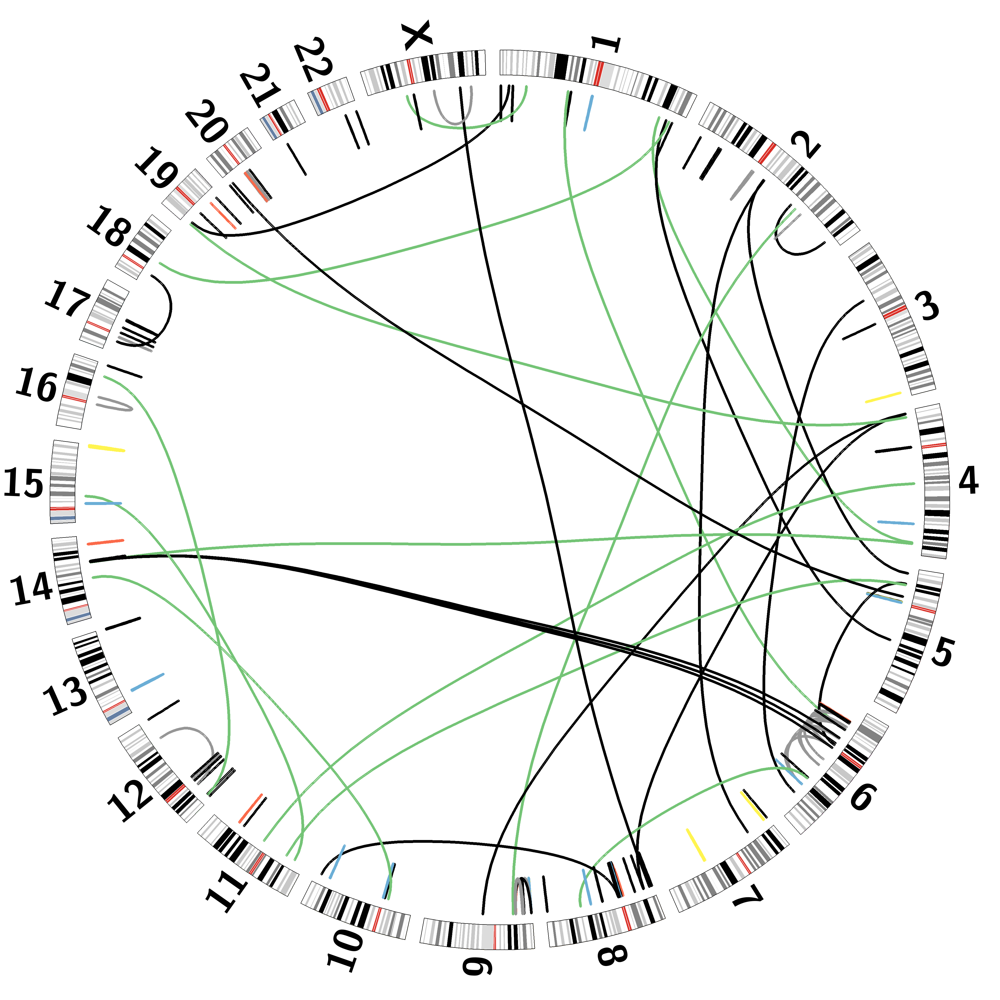

# Circos
Repository where I keep information and syntax on how to use the [circos](http://circos.ca) package.

## Breakdown of the README.md file
1. [Setup on Mac](#Setup-on-Mac)
2. [Configuration Files and Design](#Configuration-Files-and-Design)
3. [Drawing](#Drawing)
4. [Running Circos](#Running-Circos)
5. [Examples](#Examples)

## Setup on Mac
1. Download circos from [here.](http://circos.ca/software/download/circos/)
2. unpack the circos file: tar xvfz circos-version
3. Install Homebrew for Mac
  a. /bin/bash -c "$(curl -fsSL https://raw.githubusercontent.com/Homebrew/install/HEAD/install.sh)"
  b. echo 'eval "$(/opt/homebrew/bin/brew shellenv)"' >> ~/.bash_profile #can change this with the command output by your 
  c. eval "$(/opt/homebrew/bin/brew shellenv)"
4. brew install pkg-config
5. Install cpanm:
  a. curl -L https://cpanmin.us | perl - App::cpanminus --sudo
6. cpanm ExtUtils::PkgConfig --sudo
7. brew install libgd
8. export PKG_CONFIG_PATH=/path/to/pkgconfig
9. cd circos-version/bin
10. Installing required Modules
  a. sudo cpan
  b. cpanm Config::General Font::TTF::Font Math::Bezier Math::VecStat Readonly Set::IntSpan Text::Format
  c. cpanm --force GD::Polyline --sudo
  d. Install other modules that haven't changed status to okay when running: circos -modules
11. Add circos-version/bin to your $PATH variable
  a. export PATH=/path/to/circos-version/bin:$PATH

## Configuration Files and Design
Follow instructions [here](http://circos.ca/documentation/tutorials/configuration/configuration_files/lesson) for more detailed information and customization. 

Configuration file will hold all variables and values needed to customize your images. You can construct it from scratch (Not advisable) or use an already built one and customize it to your liking.
Configuration file is named as circos.conf and has a variable = value format.

Configuration files have blocks and blocks can have multiple instances. Make sure to close all your configuration blocks to avoid error.
```
<ideogram> #open the block
 thickness = 30p
 fill      = yes
</ideogram> # close the block
```

### Format
```
<plots> # global variables assigned in here

#global variable
fill_color = blue

<plot> #local vairables assinged in here
fill_color = grey # overrides the gloabl variable where fill_color = blue

</plot>

</plots>
```

### External imports syntax
```
# these 2 files should always be included (imported from /etc directory)
<<include etc/colors_fonts_patterns.conf>>
<<include etc/housekeeping.conf>>
```
You can include files anywhere in the conf file, even inside plot blocks.

#### Images
```
<image>
<<include ect/image.conf>>
file* = myfile.png #overriding file parameter inside ect/image.conf, add the astrix to indicate a new value
</image>
```

#### Minimal Configuration File
```
# circos.conf

karyotype = data/karyotype/karyotype.human.txt

<ideogram>

<spacing>
default = 0.005r
</spacing>

radius    = 0.9r
thickness = 20p
fill      = yes

</ideogram>

################################################################
# The remaining content is standard and required. It is imported 
# from default files in the Circos distribution.
#
# These should be present in every Circos configuration file and
# overridden as required. To see the content of these files, 
# look in etc/ in the Circos distribution.

<image>
# Included from Circos distribution.
<<include etc/image.conf>>
</image>

# RGB/HSV color definitions, color lists, location of fonts, fill patterns.
# Included from Circos distribution.
<<include etc/colors_fonts_patterns.conf>>

# Debugging, I/O an dother system parameters
# Included from Circos distribution.
<<include etc/housekeeping.conf>>
```
Karyotype file is always required. It should contain the names, sizes and colors for the chomosomes that will be displayed in the image. Ideogram defines where the image should appear. Uses the <ideogram> block and has parameters radius, thickness and fill. <spacing> is used to define the separations between ideograms on the figure.

#### Links
Links represent assiciation between two genomic positions. They are defined using the <link> block inside the <links> block.

### Drawing
#### Ideogram
"The chromosome is the entire sequence structure as defined in the karyotype file. The ideogram is the depiction of the chromosome, or region thereof, in the image.

A chromosome may have no ideograms (it is not drawn), a single ideogram (it is drawn in its entirety, or only a portion of the chromosome is shown) or multiple ideograms (there is an axis break, multiple regions are drawn)." [Reference 1](http://circos.ca/documentation/tutorials/ideograms/ideograms/)

The image will be a circular layout. Data tracks appear inside and outside the layout. Tracks can include links and other data representations such as scatter plots, histograms and heatmaps.

The core of the image are the axis definition, placement, size and formatting. Each point represents an interval on one of the axis. Example: chr5:1000-1500. 

<ideogram> block is dedicated to controlling the format of the ideograms.

#### Karyotype File
This file creates the outward band of the ideogram with the breaks for the chromosomes. 

Example
```
chr - CHRNAME CHRLABEL START END COLOR
chr - chr1 1 0 5000000 spectral-5-div-1
chr - chr2 2 0 10000000 spectral-5-div-2
chr - chr3 3 0 20000000 spectral-5-div-3
chr - chr4 4 0 50000000 spectral-5-div-4
chr - chr5 5 0 100000000 spectral-5-div-5
```

<ideogram>
<spacing>
  #the spacing is for the space between the chromosome breaks of the karyotype
</spacing>
</ideogram>

#### Link file
Create the links between 2 chromosomes.
Format: chromosome1 startposition1 endposition1 chromosome2 startposition2 endposition2

Example
```
chr1 10 20 chr2 400 450 color=blue
chr3 1029 2000 chr14 88292982 9292881 color=pink
```
bezier_radius is the variable inside the <link> block that determines the shape of the link.

#### Example
```
<<include colors_fonts_patterns.conf>>

<<include ideogram.conf>>
<<include ticks.conf>>

<image>
<<include etc/image.conf>>
</image>
  
#comes with the circos package  
karyotype   = data/karyotype/karyotype.human.txt

chromosomes_units = 1000000
chromosomes_display_default = no
chromosomes       = hs1;hs2;hs3 # subsets to only these 3 chromosomes

# the general links have the local variables inside the <links>
# there are 2 special link with orange and green links for the link data provided in the file variable
<links>

z      = 0
radius = 0.975r
crest  = 0.5
bezier_radius        = 0.5r
bezier_radius_purity = 0.75

<link>
z            = 50
color        = green_a2
thickness    = 4
file         = data/5/segdup.bundle3.txt
bezier_radius_purity = 0.2
crest = 1
</link>

<link>
z            = 40
color        = orange_a2
thickness    = 4
file         = data/5/segdup.bundle2.txt
bezier_radius_purity = 0.2
crest = 1
</link>
</links>
  
<<include etc/housekeeping.conf>>
data_out_of_range* = trim # overriding the data_out_of_range variable
```

## Running Circos
When circos is added to your path, you can run it like so
```
circos -conf /path/to/circos.conf
```

##Examples
<!-- -->


